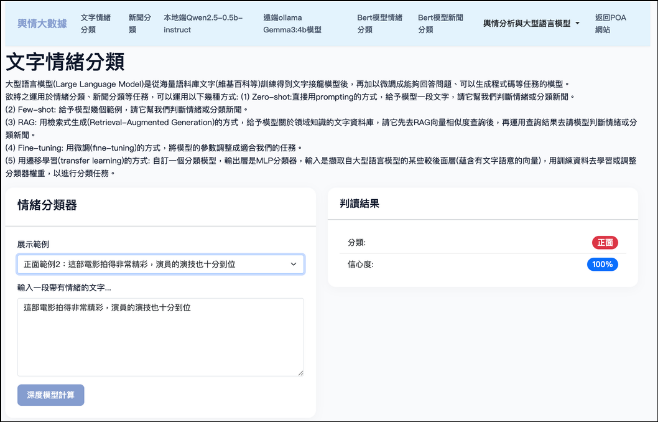
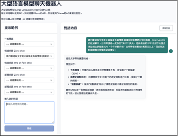
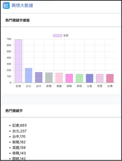

# Big Data Project

這是一個以 Django 建置的新聞輿情與大型語言模型分析平台，整合新聞資料分析、熱門關鍵字、人物聲量、文字情緒分類、關鍵字關聯分析，以及 Ollama / Transformer 模型的聊天與分類功能。

## 專案特色

- 新聞輿情分析：統計熱門關鍵字、熱門人物、命名實體與候選人聲量。
- 使用者查詢：可輸入關鍵字查看聲量、情緒、關聯詞與 LLM 產生的分析報告。
- 情緒與新聞分類：使用 BERT / Transformer 模型進行文字情緒與新聞類別判斷。
- 大型語言模型應用：整合 Ollama 與自訂 LLM classifier，提供聊天機器人與文字生成展示。
- Docker 化部署：使用 Docker Compose 同時啟動 Django、PostgreSQL、Ollama 與 Nginx。

## 專案架構

```text
.
├── django-web-poa/          # 輿情分析 Django 服務
├── django-web-llm/          # LLM 與文字分類 Django 服務
├── docker-files-poa/        # POA 服務 Docker 設定
├── docker-files-llm/        # LLM 服務 Docker 設定
├── docker-files-ollama/     # Ollama 啟動設定
├── nginx/                   # Nginx 反向代理設定
├── postgres_data/           # PostgreSQL 資料目錄
├── docs/images/             # README 成果展示圖片
└── docker-compose.yml       # 多服務部署設定
```

## 技術棧

- Backend：Django 4.1、Django REST framework
- Data：Pandas、NumPy、SciPy、SQLAlchemy、PostgreSQL
- NLP / ML：PyTorch、Transformers、BERT、FAISS
- LLM：Ollama、Gemma / Qwen 類模型應用
- Deployment：Docker Compose、Gunicorn、Nginx

## 主要功能頁面

### 輿情分析服務 `django-web-poa`

預設本機入口：`http://localhost:8000`

| 路徑 | 功能 |
| --- | --- |
| `/poa_intro/course_intro` | 課程與專案介紹 |
| `/poa_intro/api_intro` | API 功能介紹 |
| `/topword/` | 熱門關鍵字分析 |
| `/topperson/` | 熱門人物聲量分析 |
| `/keyperson/` | 關鍵人物分析 |
| `/userkeyword/` | 使用者關鍵字查詢 |
| `/userkeyword_assoc/` | 關鍵字關聯分析 |
| `/userkeyword_senti/` | 關鍵字情緒分析 |
| `/taiwanmayor/` | 台灣縣市長相關聲量分析 |
| `/userkeyword_report/` | LLM 輿情分析報告 |
| `/correlation/` | 關聯分析 |
| `/topner/` | 命名實體熱門詞分析 |

### LLM 服務 `django-web-llm`

預設本機入口：`http://localhost:8001`

| 路徑 | 功能 |
| --- | --- |
| `/` | 文字情緒分析 |
| `/news_cate/` | 新聞分類 |
| `/chatbot/` | LLM 聊天機器人 |
| `/ollama/` | Ollama 模型對話 |
| `/sentiment/` | BERT 情緒分類 |
| `/news_cls/` | BERT 新聞分類 |
| `/llm_intro/llm-introduction/` | LLM 介紹 |
| `/llm_intro/model-introduction/` | 模型介紹 |

## 快速開始

### 使用 Docker Compose

```bash
docker compose up --build
```

啟動後可開啟：

- 輿情分析系統：`http://localhost:8000`
- LLM 分析系統：`http://localhost:8001`
- Ollama API：`http://localhost:11434`
- Nginx：`http://localhost`

### 單獨啟動 Django 服務

```bash
cd django-web-poa
pip install -r requirements.txt
python manage.py runserver 8000
```

```bash
cd django-web-llm
pip install -r requirements.txt
python manage.py runserver 8001
```

## 部分功能成果展示

| 文字情緒分析 | 輿情聊天機器人 |
| --- | --- |
| 使用 BERT / Transformer 模型判斷輸入文字的情緒傾向，回傳分類結果與信心度。 | 整合大型語言模型，讓使用者輸入輿情問題後產生互動式分析回覆。 |
|  |  |

| 網路聲量分析 | 熱門關鍵字 |
| --- | --- |
| 統計新聞人物或主題的聲量排行，協助觀察不同對象的媒體曝光程度。 | 以圖表呈現新聞資料中的高頻關鍵字，快速掌握資料集主要討論議題。 |
|  |  |
